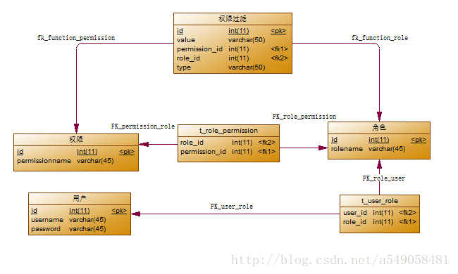
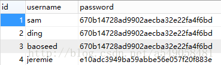
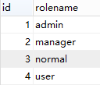
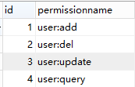
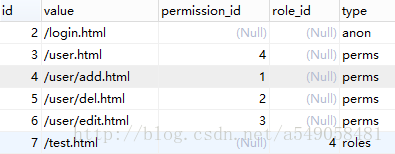
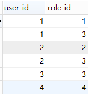
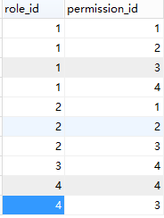
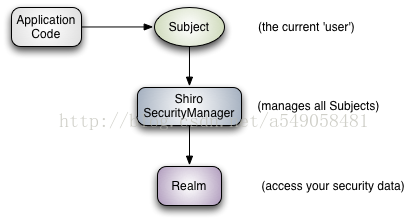

##springMVC+shiro+hibernate整合  
[<博客主页](https://jeremieastray.github.io)  
  
什么是权限？  
权限是管理web应用用户的一种手段，比如，一个电商平台，用户具有user的角色，他可以在这个商场里面进行交易。商家拥有的是user的角色同时也拥有manager的角色，因此，他可以进行买卖的同时进行对自己商品的管理。shiro就是一个基于RBAC权限设计模型的权限管理框架。  
什么是Shiro ?  
Apache Shiro是一个强大易用的Java安全框架，提供了认证、授权、加密和会话管理等功能：   
认证 - 用户身份识别，常被称为用户“登录”；  
授权 - 访问控制；  
密码加密 - 保护或隐藏数据防止被偷窥；  
会话管理 - 每用户相关的时间敏感的状态。  
以下是对使用SpringMVC+shiro+hibernate框架对用户管理的一个例子：  
附上项目：https://git.oschina.net/jeremie_astray/SpringMVC_Shiro/tree/master/  
Annotion版本：https://git.oschina.net/jeremie_astray/SpringMVC_Shiro/tree/shiro_annotation  

## 一、实体
  
对应关系：
用户与角色为一对多关系
角色与权限为多对多关系
权限过滤与角色和权限为一对一关系

t_user(,用户表，密码为md5加密，可以自己修改)  
  
t_role（角色表）  
  
t_permission(权限表)  
  
t_function(权限过滤表)  
  
t_user_role（用户-角色表，中间表）  
  
t_role_permission（角色-权限表，中间表）  
  
实体类可以在文章结尾的git链接查看  
## 二、包导入及spring配置
maven配置如下:

```
    <properties>
        <endorsed.dir>${project.build.directory}/endorsed</endorsed.dir>
        <project.build.sourceEncoding>UTF-8</project.build.sourceEncoding>
        <spring.version>4.1.0.RELEASE</spring.version>
    </properties>

    <dependencies>
        <dependency>
            <groupId>junit</groupId>
            <artifactId>junit</artifactId>
            <version>3.8.1</version>
            <scope>test</scope>
        </dependency>
        <!-- SpringMVCjar -->
        <dependency>
            <groupId>org.springframework</groupId>
            <artifactId>spring-aspects</artifactId>
            <version>${spring.version}</version>
        </dependency>
        <dependency>
            <groupId>org.springframework</groupId>
            <artifactId>spring-beans</artifactId>
            <version>${spring.version}</version>
        </dependency>
        <dependency>
            <groupId>org.springframework</groupId>
            <artifactId>spring-context</artifactId>
            <version>${spring.version}</version>
        </dependency>
        <dependency>
            <groupId>org.springframework</groupId>
            <artifactId>spring-context-support</artifactId>
            <version>${spring.version}</version>
        </dependency>
        <dependency>
            <groupId>org.springframework</groupId>
            <artifactId>spring-core</artifactId>
            <version>${spring.version}</version>
        </dependency>
        <dependency>
            <groupId>org.springframework</groupId>
            <artifactId>spring-expression</artifactId>
            <version>${spring.version}</version>
        </dependency>
        <dependency>
            <groupId>org.springframework</groupId>
            <artifactId>spring-jdbc</artifactId>
            <version>${spring.version}</version>
        </dependency>
        <dependency>
            <groupId>org.springframework</groupId>
            <artifactId>spring-orm</artifactId>
            <version>${spring.version}</version>
        </dependency>
        <dependency>
            <groupId>org.springframework</groupId>
            <artifactId>spring-tx</artifactId>
            <version>${spring.version}</version>
        </dependency>
        <dependency>
            <groupId>org.springframework</groupId>
            <artifactId>spring-web</artifactId>
            <version>${spring.version}</version>
        </dependency>
        <dependency>
            <groupId>org.springframework</groupId>
            <artifactId>spring-webmvc</artifactId>
            <version>${spring.version}</version>
        </dependency>
        <dependency>
            <groupId>org.springframework</groupId>
            <artifactId>spring-test</artifactId>
            <version>${spring.version}</version>
            <scope>test</scope>
        </dependency>
        <!-- Hibernate-->
        <dependency>
            <groupId>net.sf.ehcache</groupId>
            <artifactId>ehcache</artifactId>
            <version>2.7.2</version>
        </dependency>
        <dependency>
            <groupId>commons-dbcp</groupId>
            <artifactId>commons-dbcp</artifactId>
            <version>1.4</version>
        </dependency>
        <dependency>
            <groupId>mysql</groupId>
            <artifactId>mysql-connector-java</artifactId>
            <version>5.1.26</version>
        </dependency>
        <!-- javax提供的annotation -->
        <dependency>
            <groupId>javax.inject</groupId>
            <artifactId>javax.inject</artifactId>
            <version>1</version>
        </dependency>
        <!-- **************************** -->

        <!-- hibernate验证 -->
        <dependency>
            <groupId>org.hibernate</groupId>
            <artifactId>hibernate-core</artifactId>
            <version>4.3.6.Final</version>
        </dependency>
        <dependency>
            <groupId>org.hibernate.common</groupId>
            <artifactId>hibernate-commons-annotations</artifactId>
            <version>4.0.5.Final</version>
        </dependency>
        <dependency>
            <groupId>org.hibernate</groupId>
            <artifactId>hibernate-entitymanager</artifactId>
            <version>4.3.6.Final</version>
        </dependency>
        <dependency>
            <groupId>org.hibernate.javax.persistence</groupId>
            <artifactId>hibernate-jpa-2.1-api</artifactId>
            <version>1.0.0.Final</version>
        </dependency>
        <dependency>
            <groupId>org.hibernate</groupId>
            <artifactId>hibernate-ehcache</artifactId>
            <version>4.3.6.Final</version>
        </dependency>
        <dependency>
            <groupId>org.hibernate</groupId>
            <artifactId>hibernate-validator</artifactId>
            <version>5.1.2.Final</version>
        </dependency>
        <dependency>
            <groupId>com.mchange</groupId>
            <artifactId>c3p0</artifactId>
            <version>0.9.5-pre8</version>
        </dependency>
        <!-- jstl -->
        <dependency>
            <groupId>javax.servlet</groupId>
            <artifactId>jstl</artifactId>
            <version>1.2</version>
        </dependency>
        <!-- servlet -->
        <dependency>
            <groupId>javax.servlet</groupId>
            <artifactId>javax.servlet-api</artifactId>
            <version>3.1.0</version>
            <scope>provided</scope>
        </dependency>
        <dependency>
            <groupId>javax.servlet.jsp</groupId>
            <artifactId>javax.servlet.jsp-api</artifactId>
            <version>2.3.1</version>
            <scope>provided</scope>
        </dependency>
        <!-- Shiro -->
        <dependency>
            <groupId>org.apache.shiro</groupId>
            <artifactId>shiro-core</artifactId>
            <version>1.2.3</version>
        </dependency>
        <dependency>
            <groupId>org.apache.shiro</groupId>
            <artifactId>shiro-web</artifactId>
            <version>1.2.3</version>
        </dependency>
        <dependency>
            <groupId>org.apache.shiro</groupId>
            <artifactId>shiro-spring</artifactId>
            <version>1.2.3</version>
        </dependency>
        <dependency>
            <groupId>org.apache.shiro</groupId>
            <artifactId>shiro-ehcache</artifactId>
            <version>1.2.3</version>
        </dependency>
        <dependency>
            <groupId>commons-io</groupId>
            <artifactId>commons-io</artifactId>
            <version>2.4</version>
        </dependency>
        <dependency>
            <groupId>commons-beanutils</groupId>
            <artifactId>commons-beanutils</artifactId>
            <version>1.8.3</version>
        </dependency>
        <dependency>
            <groupId>commons-fileupload</groupId>
            <artifactId>commons-fileupload</artifactId>
            <version>1.3.1</version>
        </dependency>
        <dependency>
            <groupId>commons-lang</groupId>
            <artifactId>commons-lang</artifactId>
            <version>2.6</version>
        </dependency>
        <dependency>
            <groupId>commons-logging</groupId>
            <artifactId>commons-logging</artifactId>
            <version>1.1.2</version>
        </dependency>
        <dependency>
            <groupId>org.slf4j</groupId>
            <artifactId>slf4j-log4j12</artifactId>
            <version>1.7.5</version>
        </dependency>
        <dependency>
            <groupId>asm</groupId>
            <artifactId>asm</artifactId>
            <version>3.3.1</version>
        </dependency>
        <dependency>
            <groupId>org.aspectj</groupId >
            <artifactId>aspectjweaver</artifactId >
            <version> 1.6.11</version >
        </dependency>
    </dependencies>

    <build>
        <plugins>
            <plugin>
                <groupId>org.apache.maven.plugins</groupId>
                <artifactId>maven-compiler-plugin</artifactId>
                <version>3.1</version>
                <configuration>
                    <source>1.7</source>
                    <target>1.7</target>
                    <encoding>UTF8</encoding>
                    <compilerArguments>
                        <endorseddirs>${endorsed.dir}</endorseddirs>
                    </compilerArguments>
                </configuration>
            </plugin>
            <plugin>
                <groupId>org.apache.maven.plugins</groupId>
                <artifactId>maven-war-plugin</artifactId>
                <version>2.4</version>
                <configuration>
                    <failOnMissingWebXml>false</failOnMissingWebXml>
                </configuration>
            </plugin>
            <!-- tomcat7maven插件 -->
            <plugin>
                <groupId>org.apache.tomcat.maven</groupId>
                <artifactId>tomcat7-maven-plugin</artifactId>
                <version>2.2</version>
                <configuration>
                    <path>/</path>
                    <port>80</port>
                    <contextReloadable>true</contextReloadable>
                    <contextFile>src/main/webapp/META-INF/context.xml</contextFile>
                </configuration>
            </plugin>
            <plugin>
                <groupId>org.apache.maven.plugins</groupId>
                <artifactId>maven-dependency-plugin</artifactId>
                <version>2.6</version>
                <executions>
                    <execution>
                        <phase>validate</phase>
                        <goals>
                            <goal>copy</goal>
                        </goals>
                        <configuration>
                            <outputDirectory>${endorsed.dir}</outputDirectory>
                            <silent>true</silent>
                            <artifactItems>
                                <artifactItem>
                                    <groupId>javax</groupId>
                                    <artifactId>javaee-endorsed-api</artifactId>
                                    <version>7.0</version>
                                    <type>jar</type>
                                </artifactItem>
                            </artifactItems>
                        </configuration>
                    </execution>
                </executions>
            </plugin>
        </plugins>
    </build></span>
```
备注：maven的tomcat7插件可以使用tomcat7:run指令运行

web.xml的配置
```
    <web-app version="2.5"
         xmlns="http://java.sun.com/xml/ns/javaee"
         xmlns:xsi="http://www.w3.org/2001/XMLSchema-instance"
         xsi:schemaLocation="http://java.sun.com/xml/ns/javaee
    http://java.sun.com/xml/ns/javaee/web-app_2_5.xsd">
    <display-name>Archetype Created Web Application</display-name>

    <!--过滤字符集-->
    <filter>
        <filter-name>encoding</filter-name>
        <filter-class>org.springframework.web.filter.CharacterEncodingFilter</filter-class>
        <init-param>
            <param-name>encoding</param-name>
            <param-value>UTF-8</param-value>
        </init-param>
    </filter>
    <filter-mapping>
        <filter-name>encoding</filter-name>
        <url-pattern>/*</url-pattern>
    </filter-mapping>
    <!-- spring-orm-hibernate4的OpenSessionInViewFilter -->
    <filter>
        <filter-name>opensessioninview</filter-name>
        <filter-class>org.springframework.orm.hibernate4.support.OpenSessionInViewFilter</filter-class>
    </filter>
    <filter-mapping>
        <filter-name>opensessioninview</filter-name>
        <url-pattern>/*</url-pattern>
    </filter-mapping>

    <!-- 配置springmvc servlet -->
    <servlet>
        <servlet-name>springmvc</servlet-name>
        <servlet-class>org.springframework.web.servlet.DispatcherServlet</servlet-class>
        <load-on-startup>1</load-on-startup>
    </servlet>
    <servlet-mapping>
        <servlet-name>springmvc</servlet-name>
        <!-- / 表示所有的请求都要经过此serlvet -->
        <url-pattern>*.html</url-pattern>
    </servlet-mapping>

    <!-- spring的监听器 -->
    <context-param>
        <param-name>contextConfigLocation</param-name>
        <param-value>classpath*:applicationContext.xml</param-value>
    </context-param>
    <listener>
        <listener-class>
            org.springframework.web.context.ContextLoaderListener
        </listener-class>
    </listener>

    <!-- Shiro配置 -->
    <filter>
        <filter-name>shiroFilter</filter-name>
        <filter-class>org.springframework.web.filter.DelegatingFilterProxy</filter-class>
    </filter>
    <filter-mapping>
        <filter-name>shiroFilter</filter-name>
        <url-pattern>/*</url-pattern>
    </filter-mapping>

    <welcome-file-list>
        <welcome-file>login.html</welcome-file>
    </welcome-file-list>
</web-app>
```
备注：springmvc只对*.html进行过滤，而shiro则是对所有url进行过滤
springmvc-servlet的配置
```
    <beans xmlns="http://www.springframework.org/schema/beans"
       xmlns:xsi="http://www.w3.org/2001/XMLSchema-instance"
       xmlns:context="http://www.springframework.org/schema/context"
       xmlns:mvc="http://www.springframework.org/schema/mvc"
       xsi:schemaLocation="http://www.springframework.org/schema/beans
        http://www.springframework.org/schema/beans/spring-beans.xsd
        http://www.springframework.org/schema/context
        http://www.springframework.org/schema/context/spring-context.xsd
        http://www.springframework.org/schema/mvc 
        http://www.springframework.org/schema/mvc/spring-mvc.xsd">
    <context:component-scan base-package="com.etop" use-default-filters="false">
        <context:include-filter type="annotation" expression="org.springframework.stereotype.Controller"/>
    </context:component-scan>
    <context:component-scan base-package="com.etop.controller"/>
    <mvc:annotation-driven/>
    <!-- 根据客户端的不同的请求决定不同的view进行响应, 如 /blog/1.json /blog/1.xml -->
    <bean id="contentNegotiationManager" class="org.springframework.web.accept.ContentNegotiationManagerFactoryBean">
        <!-- 扩展名至mimeType的映射,即 /account.json => application/json -->
        <property name="favorPathExtension" value="true"/>
        <!-- 用于开启 /userinfo/123?format=json 的支持 -->
        <property name="favorParameter" value="true"/>
        <property name="parameterName" value="format"/>
        <!-- 是否忽略Accept Header -->
        <property name="ignoreAcceptHeader" value="false"/>
        <property name="mediaTypes"> <!--扩展名到MIME的映射；favorPathExtension, favorParameter是true时起作用  -->
            <value>
                ccjson=application/json
                ccxml=application/xml
                html=text/html
            </value>
        </property>
        <!-- 默认的content type -->
        <property name="defaultContentType" value="text/html"/>
    </bean>
</beans>
```
applicationContext.xml的配置
```
<beans xmlns="http://www.springframework.org/schema/beans"
       xmlns:xsi="http://www.w3.org/2001/XMLSchema-instance"
       xmlns:aop="http://www.springframework.org/schema/aop"
       xmlns:context="http://www.springframework.org/schema/context"
       xmlns:tx="http://www.springframework.org/schema/tx"
       xsi:schemaLocation="http://www.springframework.org/schema/beans http://www.springframework.org/schema/beans/spring-beans.xsd
          http://www.springframework.org/schema/aop http://www.springframework.org/schema/aop/spring-aop.xsd
          http://www.springframework.org/schema/context http://www.springframework.org/schema/context/spring-context.xsd
          http://www.springframework.org/schema/tx http://www.springframework.org/schema/tx/spring-tx.xsd
" default-lazy-init="true">

    <bean id="securityManager" class="org.apache.shiro.web.mgt.DefaultWebSecurityManager">
        <property name="realm" ref="myRealm"/>
        <!-- 使用下面配置的缓存管理器 -->
        <property name="cacheManager" ref="cacheManager"/>
    </bean>
    <!--自定义Realm-->
    <bean id="myRealm" class="com.etop.shiro.MyRealm"/>

    <!-- 配置shiro的过滤器工厂类，id- shiroFilter要和我们在web.xml中配置的过滤器一致 -->
    <bean id="shiroFilter" class="org.apache.shiro.spring.web.ShiroFilterFactoryBean">
        <!-- 调用我们配置的权限管理器 -->
        <property name="securityManager" ref="securityManager"/>
        <!-- 配置我们的登录请求地址 -->
        <property name="loginUrl" value="/login.html"/>
        <!-- 配置我们在登录页登录成功后的跳转地址，如果你访问的是非/login地址，则跳到您访问的地址 -->
        <property name="successUrl" value="/user.html"/>
        <!-- 如果您请求的资源不再您的权限范围，则跳转到/403请求地址 -->
        <property name="unauthorizedUrl" value="/403.html"/>
        <!-- 权限配置 -->
        <property name="filterChainDefinitionMap" ref="chainDefinitionSectionMetaSource"/>
    </bean>
    <!--自定义filterChainDefinitionMap-->
    <bean id="chainDefinitionSectionMetaSource" class="com.etop.shiro.ChainDefinitionSectionMetaSource"/>
    <!--shiro缓存管理器-->
    <bean id="cacheManager" class="org.apache.shiro.cache.MemoryConstrainedCacheManager"/>
    <bean id="lifecycleBeanPostProcessor" class="org.apache.shiro.spring.LifecycleBeanPostProcessor"/>

    <bean id="propertyConfigurer"
          class="org.springframework.beans.factory.config.PropertyPlaceholderConfigurer">
        <property name="locations" value="classpath:jdbc.properties"/>
    </bean>

    <!--hibernate session工厂设置-->
    <bean id="sessionFactory"
          class="org.springframework.orm.hibernate4.LocalSessionFactoryBean">
        <property name="dataSource" ref="dataSource"/>
        <property name="packagesToScan">
            <list>
                <value>com.etop.pojo</value>
            </list>
        </property>
        <property name="hibernateProperties">
            <props>
                <prop key="hibernate.dialect">org.hibernate.dialect.MySQLDialect</prop>
                <prop key="hibernate.generate_statistics">false</prop>
                <prop key="hibernate.show_sql">true</prop>
                <prop key="hibernate.format_sql">false</prop>
                <prop key="hibernate.jdbc.batch_size">50</prop>
                <prop key="jdbc.use_scrollable_resultset">false</prop>
                <prop key="javax.persistence.validation.mode">none</prop>
                <prop key="hibernate.cache.use_second_level_cache">true</prop>
                <prop key="hibernate.cache.use_query_cache">true</prop>
                <prop key="hibernate.cache.region.factory_class">org.hibernate.cache.ehcache.EhCacheRegionFactory</prop>
                <prop key="jdbc.use_scrollable_resultset">false</prop>
            </props>
        </property>
    </bean>

    <!-- c3p0 configuration -->
    <bean id="mainDataSource" class="com.mchange.v2.c3p0.ComboPooledDataSource" destroy-method="close">
        <property name="driverClass" value="${jdbc.driverClass}"/>
        <property name="jdbcUrl" value="${jdbc.url}"/>
        <property name="user" value="${jdbc.username}"/>
        <property name="password" value="${jdbc.password}"/>
        <property name="minPoolSize" value="${jdbc.minPoolSize}"/>
        <property name="maxPoolSize" value="${jdbc.maxPoolSize}"/>
        <property name="checkoutTimeout" value="${jdbc.checkoutTimeout}"/>
        <property name="maxStatements" value="${jdbc.maxStatements}"/>
        <property name="testConnectionOnCheckin" value="${jdbc.testConnectionOnCheckin}"/>
        <property name="idleConnectionTestPeriod" value="${jdbc.idleConnectionTestPeriod}"/>
    </bean>

    <bean id="dataSource"
          class="org.springframework.jdbc.datasource.LazyConnectionDataSourceProxy">
        <property name="targetDataSource">
            <ref bean="mainDataSource"/>
        </property>
    </bean>
    <context:annotation-config/>
    <context:component-scan base-package="com.etop">
        <context:exclude-filter type="regex" expression="com.cn.controller.*"/>
    </context:component-scan>

    <bean id="transactionManager"
          class="org.springframework.orm.hibernate4.HibernateTransactionManager">
        <property name="sessionFactory">
            <ref bean="sessionFactory"/>
        </property>
    </bean>

    <!-- 拦截配置 -->
    <tx:advice id="txAdvice" transaction-manager="transactionManager">
        <tx:attributes>
            <!--说明事务类别 -->
            <tx:method name="delete*" propagation="REQUIRED" read-only="false" rollback-for="java.lang.Exception"/>
            <tx:method name="save*" propagation="REQUIRED" read-only="false" rollback-for="java.lang.Exception"/>
            <tx:method name="add*" propagation="REQUIRED" read-only="false" rollback-for="java.lang.Exception"/>
            <tx:method name="update*" propagation="REQUIRED" read-only="false" rollback-for="java.lang.Exception"/>
            <tx:method name="batch*" propagation="REQUIRED" read-only="false" rollback-for="java.lang.Exception"/>
            <tx:method name="sendOpen*" propagation="REQUIRED" read-only="false" rollback-for="java.lang.Exception"/>
            <tx:method name="sendClose*" propagation="REQUIRED" read-only="false" rollback-for="java.lang.Exception"/>
            <tx:method name="find*" propagation="REQUIRED" read-only="true"/>
            <tx:method name="get*" propagation="REQUIRED" read-only="true"/>
            <tx:method name="load*" propagation="REQUIRED" read-only="true"/>
            <tx:method name="*" read-only="true"/>
        </tx:attributes>
    </tx:advice>

    <!-- 切入点 -->
    <aop:config expose-proxy="true" proxy-target-class="true">
        <!-- service层事务 -->
        <aop:advisor id="serviceTx" advice-ref="txAdvice"
                     pointcut="execution(public * com.etop.service.*.*(..))" order="1"/>
    </aop:config>

    <tx:annotation-driven/>

</beans>
```
备注：配置好自定义的Realm与chainDefinitionSectionMetaSource  
securityManager是shiro的核心，初始化时协调各个模块运行。  
realm是shiro的桥梁，进行数据源配置  
jdbc.properties:  
```
jdbc.url = jdbc:mysql://127.0.0.1:3306/shiro
jdbc.username = root
jdbc.password = root
jdbc.minPoolSize=2
jdbc.maxPoolSize=20
jdbc.checkoutTimeout=3000
jdbc.maxStatements=50
jdbc.testConnectionOnCheckin = false
jdbc.idleConnectionTestPeriod = 18000
```
## 三、自定义Realm及自定义filterChainDefinition
Realm是shiro获取身份验证相关信息与获取授权信息的重写:  
获取授权信息(doGetAuthorizationInfo())：通过用户名和userService接口就可以获取对应角色及权限信息。  
获取身份验证相关信息(doGetAuthenticationInfo())：首先根据传入的用户名获取User信息；然后如果user为空，那么抛出没找到帐号异常UnknownAccountException；如果user找到但锁定了抛出锁定异常LockedAccountException；最后生成AuthenticationInfo信息，交给间接父类AuthenticatingRealm使用CredentialsMatcher进行判断密码是否匹配，如果不匹配将抛出密码错误异常IncorrectCredentialsException；另外如果密码重试此处太多将抛出超出重试次数异常ExcessiveAttemptsException；  
而filterChainDefinition则是对url访问权限的重写:  
产生责任链，确定每个url的访问权限  
参见格式如下:  
/static/**=anon    
<!-- perms[user:query]表示访问此连接需要权限为user:query的用户 -->    
/user=perms[user:query]    
<!-- roles[manager]表示访问此连接需要用户的角色为manager -->    
/user/add=roles[manager]    
/user/del/**=roles[admin]    
/user/edit/**=roles[manager]   
原本是由ini文件直接读取，我这里写成由数据库读取，方便管理  
MyRealm.java  
```
import java.util.Collection;

import javax.inject.Inject;

import com.etop.service.UserService;
import org.apache.shiro.authc.AuthenticationException;
import org.apache.shiro.authc.AuthenticationInfo;
import org.apache.shiro.authc.AuthenticationToken;
import org.apache.shiro.authc.SimpleAuthenticationInfo;
import org.apache.shiro.authc.UsernamePasswordToken;
import org.apache.shiro.authz.AuthorizationInfo;
import org.apache.shiro.authz.SimpleAuthorizationInfo;
import org.apache.shiro.realm.AuthorizingRealm;
import org.apache.shiro.subject.PrincipalCollection;
import org.springframework.stereotype.Service;
import org.springframework.transaction.annotation.Transactional;

import com.etop.pojo.Role;
import com.etop.pojo.User;

/**
 * Created by Jeremie on 2014/10/1.
 */

@Service
@Transactional
public class MyRealm extends AuthorizingRealm{

    @Inject
    private UserService userService;
    /**
     * <span style="font-family: Helvetica, Tahoma, Arial, sans-serif; font-size: 14px; line-height: 25.2000007629395px;"><span style="font-family: Helvetica, Tahoma, Arial, sans-serif; font-size: 14px; line-height: 25.2000007629395px;">获取授权信息</span></span>
     */
    @Override
    protected AuthorizationInfo doGetAuthorizationInfo(PrincipalCollection principalCollection) {
        //获取登录时输入的用户名  
        String loginName=(String) principalCollection.fromRealm(getName()).iterator().next();
        //到数据库获取此用户
        User user=userService.findByName(loginName);
        if(user!=null){
            //权限信息对象info,用来存放查出的用户的所有的角色（role）及权限（permission）  
            SimpleAuthorizationInfo info=new SimpleAuthorizationInfo();
            //用户的角色集合
            info.setRoles(user.getRolesName());
            //用户的角色对应的所有权限，如果只使用角色定义访问权限
            Collection<Role> roleList=user.getRoleList();
            for (Role role : roleList) {
                info.addStringPermissions(role.getPermissionsName());
            }
            return info;
        }
        return null;
    }

    /**
     * 获取身份验证相关信息
     */
    @Override
    protected AuthenticationInfo doGetAuthenticationInfo(
            AuthenticationToken authenticationToken) throws AuthenticationException {
        //UsernamePasswordToken对象用来存放提交的登录信息  
        UsernamePasswordToken token=(UsernamePasswordToken) authenticationToken;
        //查出是否有此用户  
        User user=userService.findByName(token.getUsername());
        if(user!=null){
            //若存在，将此用户存放到登录认证info中  
            return new SimpleAuthenticationInfo(user.getUsername(), user.getPassword(), getName());
        }
        return null;
    }

}
```

ChainDefinitionSectionMetaSource.java
```
package com.etop.shiro;

import com.etop.pojo.Function;
import com.etop.service.FunctionService;
import org.apache.commons.lang.StringUtils;
import org.apache.shiro.config.Ini;
import org.springframework.beans.factory.FactoryBean;
import org.springframework.beans.factory.annotation.Autowired;

import java.util.Iterator;
import java.util.List;

/**
 * Created by Jeremie on 2014/10/1.
 */
public class ChainDefinitionSectionMetaSource implements FactoryBean<Ini.Section> {

    @Autowired
    private FunctionService functionService;

    //静态资源访问权限
    private String filterChainDefinitions = "/static/**=anon";

    @Override
    public Ini.Section getObject() throws Exception {
        List<Function> list = functionService.findAll();
        Ini ini = new Ini();
        //加载默认的url
        ini.load(filterChainDefinitions);
        Ini.Section section = ini.getSection(Ini.DEFAULT_SECTION_NAME);
        //循环Resource的url,逐个添加到section中。section就是filterChainDefinitionMap,
        //里面的键就是链接URL,值就是存在什么条件才能访问该链接
        for (Iterator<Function> it = list.iterator(); it.hasNext(); ) {
            Function function = it.next();
            //构成permission字符串
            if (StringUtils.isNotEmpty(function.getValue()) && StringUtils.isNotEmpty(function.getType())) {
                String permission = "";
                switch(function.getType()){
                    case "anon":
                        permission = "anon";
                        break;
                    case "perms":
                        permission = "perms[" + function.getPermission().getPermissionname() + "]";
                        break;
                    case "roles":
                        permission = "roles[" + function.getRole().getRolename() + "]";
                        break;
                    default:
                        break;
                }
                section.put(function.getValue(), permission);
            }

        }
        //所有资源的访问权限，必须放在最后
        section.put("/**", "authc");
        return section;
    }

    @Override
    public Class<?> getObjectType() {
        return this.getClass();
    }

    @Override
    public boolean isSingleton() {
        return false;
    }
}
```
## 四、jsp页面及Controller

登录界面login.jsp  
```
<%@ page language="java"  pageEncoding="UTF-8"%>  
<%@ taglib prefix="c" uri="http://java.sun.com/jsp/jstl/core" %>  
<!DOCTYPE HTML PUBLIC "-//W3C//DTD HTML 4.01 Transitional//EN">
<html>
<head>
    <title>登录页面</title>
    <script type="text/javascript" src="static/js/md5.js"></script>
</head>

<body>

# 登录页面----<span style="color: red;">${message }</span>

<form action="/login.html" name="user" method="post">
    用户名：<input type="text" name="username"/> 

    密  码：<input type="password" id="password" name="password"/> 

    <input type="button" onclick="submitform()" value="登录"/>
    <input type="reset" value="重置"/>
</form>
</body>
<script type="text/javascript">
    function submitform(){
        var password = document.getElementById("password");
        document.getElementById("password").value = hex_md5(password.value);
        document.user.submit();
    }
</script>
</html>  
```
登陆成功后的页面user.jsp
```
<%@ page language="java" pageEncoding="UTF-8" %>
<%@ taglib prefix="c" uri="http://java.sun.com/jsp/jstl/core" %>
<%@ taglib prefix="shiro" uri="http://shiro.apache.org/tags" %>
<!DOCTYPE HTML PUBLIC "-//W3C//DTD HTML 4.01 Transitional//EN">
<html>
<head>
    <title>用户列表</title>
    <script type="text/javascript" src="static/js/jquery-2.0.3.min.js"></script>
</head>
<body>

# ${message }

# 用户列表<shiro:hasPermission name="user:add">--[添加用户](/user/add.html)</shiro:hasPermission>---[退出登录](/logout.html)

## 权限列表

<shiro:authenticated>用户已经登录显示此内容</shiro:authenticated>

<shiro:hasRole name="manager">manager角色登录显示此内容</shiro:hasRole>

<shiro:hasRole name="admin">admin角色登录显示此内容</shiro:hasRole>

<shiro:hasRole name="normal">normal角色登录显示此内容</shiro:hasRole>

<shiro:hasRole name="user">

测试专用！！
</shiro:hasRole>
<shiro:hasAnyRoles name="manager,admin">**manager or admin 角色用户登录显示此内容**</shiro:hasAnyRoles>

============================我是邪恶的分割线==========================

<shiro:principal/>-显示当前登录用户名

<shiro:hasPermission name="user:add">user:add权限用户显示此内容</shiro:hasPermission>

<shiro:hasPermission name="user:del">user:del权限用户显示此内容</shiro:hasPermission>

<shiro:hasPermission name="user:update">user:update权限用户显示此内容</shiro:hasPermission>

<shiro:hasPermission name="user:query">user:query权限用户显示此内容</shiro:hasPermission>

<shiro:lacksPermission name="user:add">不具有user:add权限用户显示此内容</shiro:lacksPermission>

<shiro:lacksPermission name="user:del">不具有user:del权限用户显示此内容</shiro:lacksPermission>

<shiro:lacksPermission name="user:update">不具有user:update权限用户显示此内容</shiro:lacksPermission>

<shiro:lacksPermission name="user:query">不具有user:query权限用户显示此内容</shiro:lacksPermission>

<shiro:hasPermission name="user:query">所有用户列表
</shiro:hasPermission>

    <c:forEach items="${userList }" var="user">*   <shiro:hasPermission name="user:query">用户名：${user.username }</shiro:hasPermission>
            <shiro:hasPermission name="user:query">----密码：${user.password }</shiro:hasPermission>
            <shiro:hasPermission name="user:update">----[修改用户](/user/edit.html?id=${user.id})</shiro:hasPermission>
            <shiro:hasPermission name="user:del">----[删除用户](javascript:void(0);)</shiro:hasPermission>
<script type="text/javascript">
    $(function () {
        $(".del").click(function () {
            var id = $(this).attr("ref");
            $.ajax({
                type: "GET",
                url: "/user/del.html?id="+id,
                success: function (e) {
                    alert("删除成功(不是真删除，测试而已)");
                },
                error: function(json){
                    alert("删除失败");
                }
            });
        });
    });
</script>
</body>
</html>
```
拥有此权限的页面：success.jsp
```
<%@ page contentType="text/html;charset=UTF-8" language="java" %>
<html>
<head>
    <title></title>
</head>
<body>
    url权限控制：
    有此权限功能
</body>
</html>
```
403页面
```
<%@ page language="java"  pageEncoding="UTF-8"%>
<!DOCTYPE HTML PUBLIC "-//W3C//DTD HTML 4.01 Transitional//EN">
<html>
<head>
    <title>权限错误</title>
</head>

<body>

# 403，You don't have permission to access / on this server

</body>
</html>
```
静态引用js  
    

UserController.java  
如果有对应权限，则会进入此Controller转发到success.jsp,否则会被shiro转发到403.jsp
```
package com.etop.controller;

import com.etop.basic.controller.BaseController;
import org.springframework.stereotype.Controller;
import org.springframework.web.bind.annotation.RequestMapping;
import org.springframework.web.bind.annotation.RequestMethod;
import org.springframework.web.bind.annotation.ResponseBody;

/**
 * Created by Jeremie on 2014/10/3.
 */
@Controller
@RequestMapping("/user")
public class UserController extends BaseController {

    //add,edit,del页面并没有写具体逻辑，要验证是否成功，需要观察控制台输出。
    @RequestMapping("/add.html")
    public String addUser(){
        return "/success.jsp";
    }

    @RequestMapping("/edit.html")
    public String updateUser(int id){
        System.out.println("=========================================>要修改的id为:" + id);
        return "/success.jsp";
    }

    @ResponseBody
    @RequestMapping(value = "/del.html",produces = "text/html; charset=utf-8",method= RequestMethod.GET)
    public String deleteUser(String id){
        System.out.println("=========================================>要删除的id为:" + id);
        return "";
    }
}
```
HomeController.java
处理用户登录，用户登出  
其中SecurityUtils.getSubject().login(new UsernamePasswordToken(user.getUsername(), user.getPassword()));为登录方法  
这是shiro的验证的顺序:    
      

```
package com.etop.controller;

import javax.validation.Valid;

import com.etop.basic.controller.BaseController;
import com.etop.service.UserService;
import org.apache.commons.lang.StringUtils;
import org.apache.shiro.SecurityUtils;
import org.apache.shiro.authc.AuthenticationException;
import org.apache.shiro.authc.UsernamePasswordToken;
import org.springframework.beans.factory.annotation.Autowired;
import org.springframework.context.annotation.Bean;
import org.springframework.stereotype.Controller;
import org.springframework.ui.Model;
import org.springframework.validation.BindingResult;
import org.springframework.web.bind.annotation.ModelAttribute;
import org.springframework.web.bind.annotation.RequestMapping;
import org.springframework.web.bind.annotation.RequestMethod;

import com.etop.pojo.User;
import org.springframework.web.servlet.mvc.support.RedirectAttributes;

import java.util.List;

@Controller
public class HomeController extends BaseController {

    @Autowired
    private UserService userService;

    @RequestMapping(value="/login.html",method=RequestMethod.GET,produces = "text/html; charset=utf-8")
    public String loginForm(Model model,String message){
        if(!StringUtils.isEmpty(message))
            model.addAttribute(message);
        model.addAttribute("user", new User());
        return "/login.jsp";
    }

    @RequestMapping(value="/login.html",method=RequestMethod.POST,produces = "text/html; charset=utf-8")
    public String login(@Valid User user,BindingResult bindingResult,Model model,RedirectAttributes attr){
        try {
            if(bindingResult.hasErrors()){
                addMessage(attr, "用户名或密码错误");
                return "redirect:/login.html";
            }
            //使用shiro管理登录
            SecurityUtils.getSubject().login(new UsernamePasswordToken(user.getUsername(), user.getPassword()));
            //获取所有用户信息，权限由前端shiro标签控制
            List<User> userList = userService.getAllUser();
            model.addAttribute("userList", userList);
            return "/user.jsp";
        } catch (AuthenticationException e) {
            addMessage(attr, "用户名或密码错误");
            return "redirect:/login.html";
        }
    }

    @RequestMapping(value="/logout.html",method=RequestMethod.GET)
    public String logout(RedirectAttributes attr){
        //使用权限管理工具进行用户的退出，注销登录
        SecurityUtils.getSubject().logout();
        addMessage(attr, "您已安全退出");
        return "redirect:/login.html";
    }

    @RequestMapping("/403.html")
    public String unauthorizedRole(){
        return "/403.jsp";
    }
} 
```
## 五、补充内容，有关网页权限的注解配置，详见项目第二个分支  
po主几经波折，终于把使用注解的方式来通过权限来控制url的访问给弄好了。  
首先附上经过修改后的userController注解版（具体用法）  
```
package com.etop.controller;

import com.etop.basic.controller.BaseController;
import org.apache.shiro.authz.UnauthorizedException;
import org.apache.shiro.authz.annotation.RequiresPermissions;
import org.springframework.stereotype.Controller;
import org.springframework.web.bind.annotation.RequestMapping;
import org.springframework.web.bind.annotation.RequestMethod;
import org.springframework.web.bind.annotation.ResponseBody;

/**
 * 处理用户操作的控制器
 *
 * Created by Jeremie on 2014/10/3.
 */
@Controller
@RequestMapping("/user")
public class UserController extends BaseController {

    @RequiresPermissions(value = "user:add")
    @RequestMapping("/add.html")
    public String addUser() throws UnauthorizedException {
        return "/success.jsp";
    }

    @RequiresPermissions(value = "user:edit")
    @RequestMapping("/edit.html")
    public String updateUser(int id){
        System.out.println("=========================================>要修改的id为:" + id);
        return "/success.jsp";
    }

    @RequiresPermissions(value = "user:del")
    @ResponseBody
    @RequestMapping(value = "/del.html",produces = "text/html; charset=utf-8",method= RequestMethod.GET)
    public String deleteUser(String id){
        System.out.println("=========================================>要删除的id为:" + id);
        return "";
    }

}
```
备注：（附各种权限的注解）  
1)@RequiresAuthentication 需要通过验证后的权限  
2)@RequiresGuest 游客权限可以通过  
3)@RequiresPermissions("user:add") 需要当前角色拥有user:add权限才能通过  
4)@RequiresRoles("admin") 需要admin角色才能通过  
5)@RequiresUser 需要有已知身份的角色才能通过  
6)若不具备权限，程序会抛出UnauthorizedException，可以对其进行捕获处理(这里的处理是跳到403页面)  
```
@ExceptionHandler(Exception.class)
    public String handleException(Exception ex, HttpServletRequest request){
        if(ex instanceof UnauthorizedException){
            log.error("当前用户没有此权限");
            return "/403.jsp";
        }else {
            log.error("系统发生异常", ex);
            ex.printStackTrace();
            request.setAttribute("exMsg", ex.getMessage());
            return "errors/exception";
        }
    }
```
相关配置（重要，po主就是因为漏了这段配置，一直没能成功截获）：  
springmvc_servlet.xml:  
```
    <context:component-scan base-package="com.etop" use-default-filters="false">
        <context:include-filter type="annotation" expression="org.springframework.stereotype.Controller"/>
        <context:include-filter type="annotation" expression="org.springframework.web.bind.annotation.ControllerAdvice"/>
    </context:component-scan>
    <aop:config proxy-target-class="true"></aop:config>
    <bean class="org.apache.shiro.spring.security.interceptor.AuthorizationAttributeSourceAdvisor">
        <property name="securityManager" ref="securityManager"/>
    </bean>
    <context:component-scan base-package="com.etop.controller"/>
<context:include-filter type="annotation" expression="org.springframework.web.bind.annotation.ControllerAdvice"/>
<bean class="org.apache.shiro.spring.security.interceptor.AuthorizationAttributeSourceAdvisor">
        <property name="securityManager" ref="securityManager"/>
    </bean>
```
扫描Controller的时候，必须把shiro的注解部分进行扫描  
另外，分支二加入了缓存的配置方式，具体在项目中体现。  
最后，为方便大家，再次附上项目链接：  
项目：https://git.oschina.net/jeremie_astray/SpringMVC_Shiro/tree/master/  
Annotion版本：https://git.oschina.net/jeremie_astray/SpringMVC_Shiro/tree/shiro_annotation  
