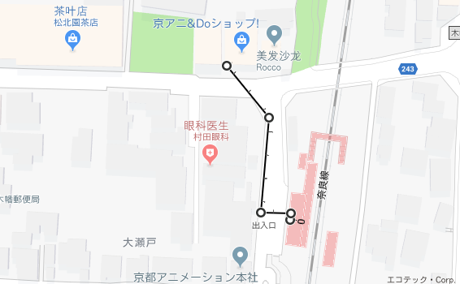

##京阿尼 京shop 手绘原画稿  
[<博客主页](https://jeremieastray.github.io)    
  
6月23号，9天行程的倒数第二天。今天早上来到了木幡，巡礼京阿尼的本部~小黄屋。  
  
地图位置  
 
  
JR木幡站  
 
  
京阿尼本社    
   
  
   
  
京shop  
   
  
因为商店里面不能拍照，我就没有拍里面的照片了（其实有一张）  
预售中的商品  
   
  
## 下面是我在京shop买到的~  
  
冰菓的明信片（相框是我自己装上的）   
   
 
 
  
K-ON明信片  
   
   
  
正在上映的利兹与青鸟立牌  
   
  
玉子爱情故事木框挂画  

  
利兹与青鸟挂画  

  
紫罗兰永恒花园CREATOR'S MESSAGE BOOK    

   
京shop商品袋子（バジ）   
   
  
## 接下来是重头戏  
  
利兹与青鸟明信片一套  
   
   
   
   
   
   
   
   
   
   
   
   
  
  
CLANNAD 古河渚手绘原画稿  

  
K-ON 平泽唯手绘原画稿  

